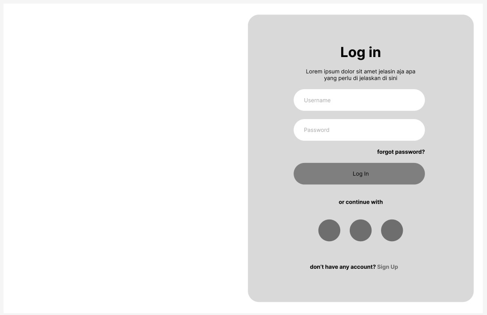
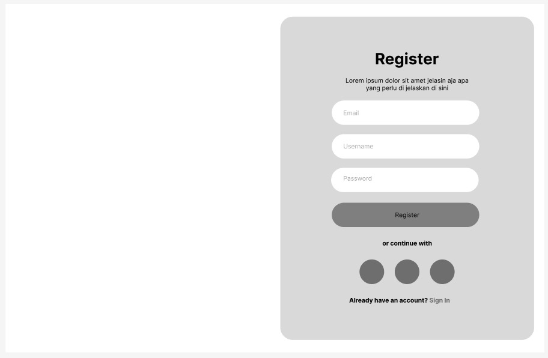
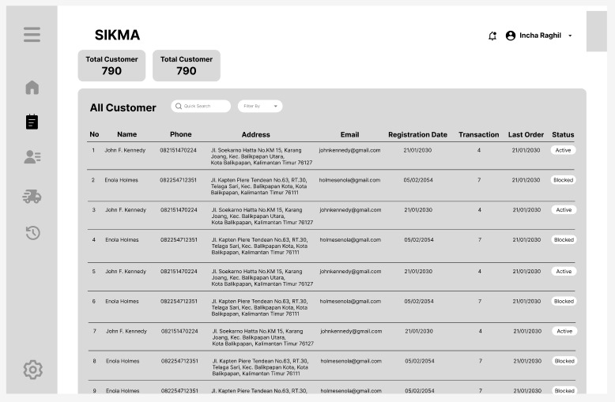
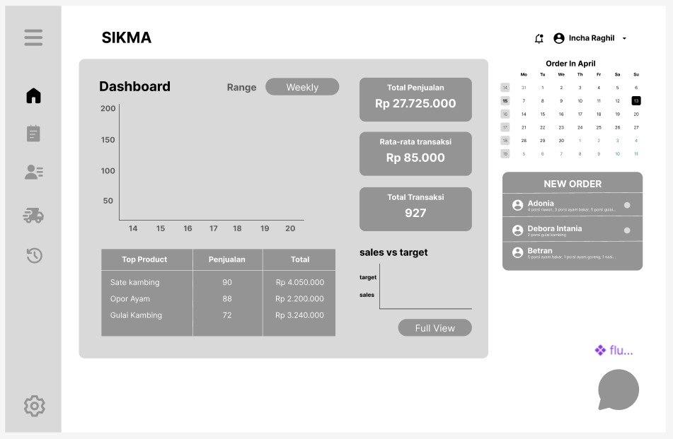

# Laporan Progres Mingguan - [SIKMA]
**Kelompok**: [3]

**Mitra**: [Warung Pak Jhon]

**Pekan ke-**: [9]

**Tanggal**: [13/04/2025]
## Progress Summary
Proyek SIKMA (Sistem Informasi Catering Makanan) untuk mitra UMKM Warung Pak Jhon saat ini berada di tahap awal pengembangan. Setelah pertemuan dengan mitra, tim merancang fitur MVP seperti registrasi, login, manajemen menu makanan, pelanggan, ulasan, pengiriman, dan riwayat pembelian. Wireframe awal telah disiapkan, bersama dengan struktur proyek dan repository menggunakan React, Express, PostgreSQL, serta teknologi pendukung seperti Vite dan Postman. Pengembangan sistem terus berjalan untuk memenuhi kebutuhan pemesanan catering secara efisien.

## Accomplished Tasks
- Pertemuan dengan mitra untuk identifikasi kebutuhan
- Menentukan fitur MVP (Minimum Viable Product)
- Membuat wireframe/mockup awal
- Menyiapkan struktur proyek dan repository
- Menentukan teknologi pendukung (selain React, Express, PostgreSQL)

## Challenges & Solutions
- **Challenge 1**: Tim masih menentukan timeline pengerjaan dan jobdesk
  - **Solution**: Melakukan Diskusi bersama untuk pembagian jobdesk yang di susun pada spreadsheet
- **Challenge 2**: mengalami kesulitan dalam membuat mockup 
  - **Solution**: Mempelajari cara menggunakan figma dan mencari referensi web catering

## Next Week Plan
- Merancang skema database
- Mengimplementasikan struktur database di PostgreSQL
- Membuat REST API skeleton (endpoint dasar)
- Menyiapkan struktur frontend basic
- Demo progress ke mitra
- Melanjutkan Desain UI/UX

## Contributions
- **Incha Ragil (Project Manager & UI/UX Designer)**: Menentukan Fitur (MVP), Membuat Mockup 
- **Debora Intania Subekti (Backend Developer)**: Menentukan Fitur (MVP), Membuat repository
- **Adonia Azarya Tamalonggehe (QA & DevOps)**: Menentukan Fitur (MVP), Menyusun Laporan Markdown dan dokumentasi
- **Betran (Frontend Developer)**: Menentukan Fitur (MVP), membuat repository

## Screenshots / Demo

 
 