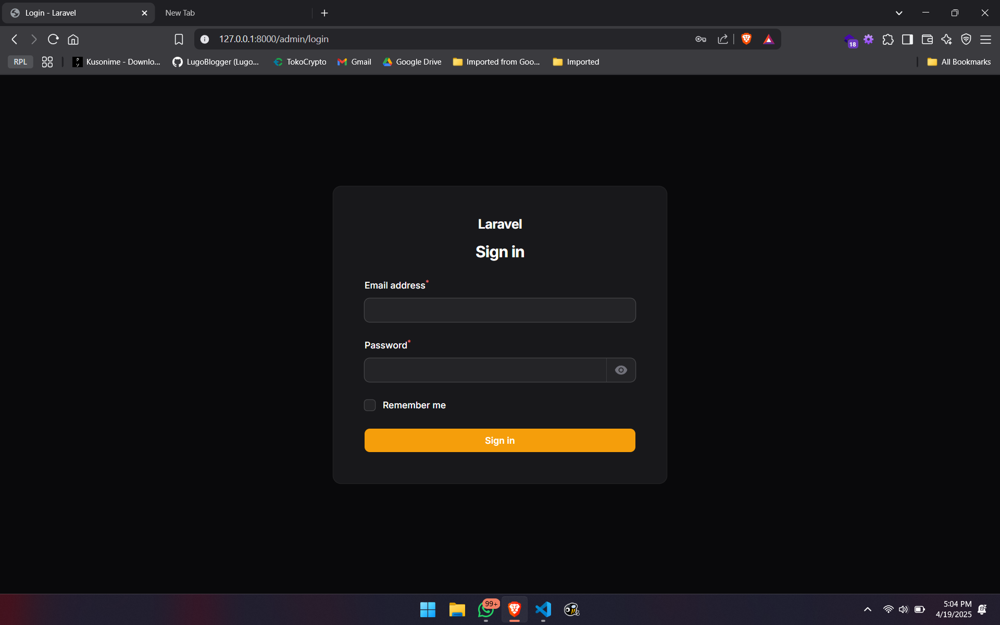

# Laporan Progres Mingguan - [SIKMA]
**Kelompok**: [3]

**Mitra**: [Warung Pak Jhon]

**Pekan ke-**: [10]

**Tanggal**: [18/04/2025]

### Github SIKMA : https://github.com/intniaaa20/Sikma
## Progress Summary
Pada Tugas Pekan 10, fokus utama adalah merancang dan mengimplementasikan elemen dasar sistem untuk SIKMA (Sistem Informasi Catering Makanan). Progres mencakup pembuatan desain database menggunakan ERD dan implementasinya di PostgreSQL, pengembangan REST API skeleton dengan Express.js, serta penyusunan struktur frontend dasar menggunakan React. Demo progress juga telah dilakukan kepada mitra (Warung Pak Jhon) untuk memastikan arah pengembangan sesuai kebutuhan. Hasil utama meliputi database terstruktur, backend dengan endpoint dasar, dan frontend siap dikembangkan lebih lanjut.

## Accomplished Tasks
- Merancang Skema Database 
- Mengimplementasikan struktur database di postgreSQL
- Membuat REST API (endpoint dasar)
- Menyiapkan struktur frontend basic

## Challenges & Solutions
- **Challenge 1**: Kami mengalami kesusahan saat menggunakan laravel karna belum terbiasa dengan laravel jadi harus berdaptasi lagi dengan laravel
  - **Solution**: buat nyelesaikan masalahnya itu dengan belajar dokumentasi sama nonton tutorial di youtube

## Next Week Plan
- Mengimplementasikan sistem autentikasi (Login dan Registetr)
- Implementasi fitur inti #1 (sesuai kebutuhan mitra)
- Integrasi frontend-backend untuk fitur yang sudah ada
- Demo progress ke mitra

## Contributions
- **Incha Ragil (Project Manager & UI/UX Designer)**: Membuat ERD
- **Debora Intania Subekti (Backend Developer)**: Membuat struktur database, membuat frontend dan backend skeleton
- **Adonia Azarya Tamalonggehe (QA & DevOps)**: Membuat ERD,Menyusun Markdown
- **Betran (Frontend Developer)**: Membuat struktur database, membuat frontend dan backend skeleton

## Screenshots / Demo 
### ERD
.png>)

### Struktur Database

### Rest API
[https://github.com/intniaaa20/Sikma/blob/4010b5671b7833e4e165a6eec641da0c90c28474/routes/api.php](https://github.com/intniaaa20/Sikma/blob/4010b5671b7833e4e165a6eec641da0c90c28474/routes/api.php)

### FRONTEND BASIC

[https://github.com/intniaaa20/Sikma/blob/4010b5671b7833e4e165a6eec641da0c90c28474/routes/web.php](https://github.com/intniaaa20/Sikma/blob/4010b5671b7833e4e165a6eec641da0c90c28474/routes/web.php)