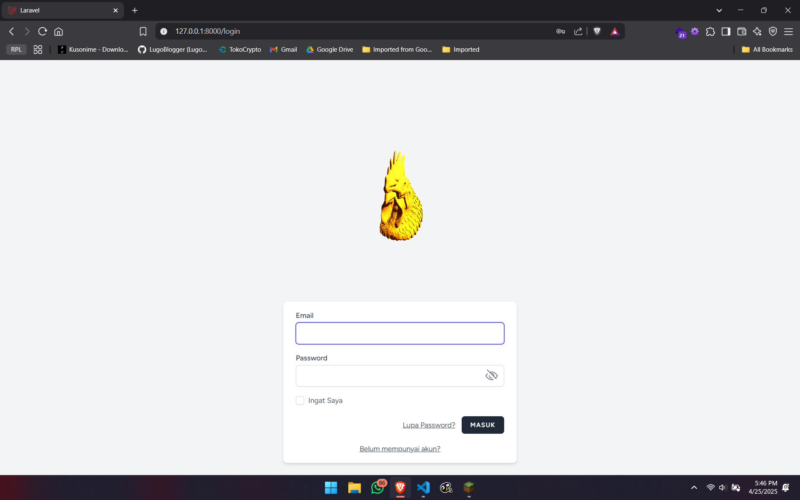
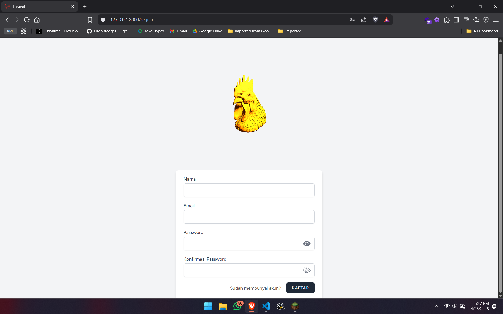

# Laporan Progres Mingguan - [SIKMA]
**Kelompok**: [3]

**Anggota**
    
    -Adonia Azarya Tamalonggehe (10231007)
    -Betran (10231023)
    -Debora Intania Subekti (10231029)
    -Incha Ragil (10231043)


**Mitra**: [Warung Pak Jhon]

**Pekan ke-**: [11]

**Tanggal**: [25/04/2025]

### Github SIKMA : https://github.com/intniaaa20/Sikma

## Progress Summary
Pada Tugas Pekan 11, fokus utama adalah mengimplementasikan sistem autentikasi (login/register) menggunakan JWT dan mengembangkan fitur inti pertama seperti manajemen menu makanan. Backend telah dilengkapi dengan endpoint REST API yang mendukung fitur tersebut, serta integrasi frontend-backend telah berhasil diuji. Hasilnya, pengguna dapat melakukan autentikasi dan mengakses salah satu fitur utama aplikasi. Langkah ini memperkuat fondasi SIKMA untuk pengembangan fitur lanjutan.

## Accomplished Tasks
- Implementasi sistem autentikasi (login/register)
- Implementasi fitur inti #1 (sesuai kebutuhan mitra)
- Integrasi frontend-backend untuk fitur yang sudah ada

## Dokumentasi Web Sikma
---

### **1. Halaman Login (`/login`)**

**Deskripsi:**
- Tampilan ini adalah halaman login aplikasi Laravel.
- Terdapat dua kolom input:
  - **Email**: Pengguna memasukkan alamat email mereka.
  - **Password**: Pengguna memasukkan kata sandi mereka.
- Ada juga opsi "Ingat Saya" (Remember Me) untuk menyimpan sesi login.
- Terdapat link "Lupa Password?" untuk mengarahkan pengguna ke halaman reset password.
- Tombol "MASUK" digunakan untuk melakukan login.
- Jika pengguna belum memiliki akun, ada link "Belum mempunyai akun?" yang mengarahkan ke halaman registrasi.


---

### **2. Halaman Register (`/register`)**

**Deskripsi:**
- Tampilan ini adalah halaman pendaftaran akun baru.
- Terdapat beberapa kolom input:
  - **Nama**: Nama lengkap pengguna.
  - **Email**: Alamat email pengguna.
  - **Password**: Kata sandi yang akan digunakan.
  - **Konfirmasi Password**: Pengguna diminta mengulangi kata sandi untuk memastikan kesesuaian.
- Ada tombol "DAFTAR" untuk menyelesaikan proses pendaftaran.
- Jika pengguna sudah memiliki akun, ada link "Sudah mempunyai akun?" yang mengarahkan kembali ke halaman login.


---

### **3. Halaman Forgot Password (`/forgot-password`)**

**Deskripsi:**
- Tampilan ini adalah halaman untuk meminta reset password.
- Terdapat satu kolom input:
  - **Email**: Pengguna memasukkan alamat email yang terdaftar.
- Terdapat tombol "RESET PASSWORD" untuk mengirim permintaan reset password.
- Ada pesan penjelasan bahwa pengguna akan menerima tautan melalui email untuk menyetel ulang kata sandi mereka.
- Link "Back to Login" mengarahkan pengguna kembali ke halaman login.


---

### **4. Halaman Dashboard (`/dashboard`)**

**Deskripsi:**
- Tampilan ini adalah halaman utama setelah pengguna berhasil login.
- Terdapat pesan selamat datang: "You're logged in!" (Anda telah masuk!).
- Ada deskripsi singkat tentang aplikasi, seperti tujuan utama aplikasi (contoh: "Aplikasi ini dirancang untuk membantu mengelola...").
- Judul halaman adalah "Dashboard".

**Kegunaan:**
Halaman ini memberikan akses ke fitur-fitur utama aplikasi dan menampilkan informasi penting bagi pengguna yang telah login.

### **5. Tampilan Database (`Object Explorer`)**

**Deskripsi:**
- Ini adalah tampilan database dari aplikasi Laravel, kemungkinan menggunakan PostgreSQL sebagai sistem manajemen database.
- Terdapat tabel-tabel yang tersedia dalam database, seperti:
  - `users`: Menyimpan data pengguna (id, nama, email, password, dll.).
  - `games`, `genres`, `feedback`, dll.: Tabel-tabel lain yang mendukung fitur aplikasi.
- Tampilan ini juga menunjukkan query SQL yang digunakan untuk mengambil data dari tabel `users`:
  ```sql
  SELECT * FROM public.users ORDER BY id ASC;
  ```
- Data output menampilkan beberapa baris dari tabel `users`, termasuk:
  - `id`: ID unik pengguna.
  - `name`: Nama pengguna.
  - `email`: Email pengguna.
  - `password`: Kata sandi yang telah dienkripsi.
  - Kolom lain seperti `email_verified_at` dan `remember_token`.

Pengujian integrasi terlihat dari interaksi antara frontend, backend, dan database dalam aplikasi SIKMA. Halaman Login , Register , dan Forgot Password menunjukkan bahwa frontend berhasil berkomunikasi dengan backend untuk memproses data pengguna dan mengelolanya di database PostgreSQL (tabel users). Data seperti nama, email, dan password disimpan serta diverifikasi melalui backend. Pada halaman Dashboard , informasi pengguna ditampilkan setelah login, membuktikan bahwa frontend mengambil data dari backend yang terhubung ke database.

## Desain Figma Sikma

### **1. Dashboard Utama (Orders)**

- **Deskripsi**: Dashboard utama untuk manajemen pesanan catering.
- **Fitur Utama**:
  - Statistik visual: **Total Pesanan Diterima**, **Sedang Diproses**, **Dalam Pengiriman**, dan **Telah Selesai**.
  - Tabel daftar pesanan dengan detail seperti **ID Pesanan**, **Nama Customer**, **Tanggal Pesanan**, **Alamat Pengiriman**, **Total Harga**, **Status Pengiriman**, serta tombol **Chat** untuk komunikasi langsung dengan pelanggan.

---

### **2. Dashboard Utama (Shipments)**

- **Deskripsi**: Dashboard untuk memantau status pengiriman pesanan.
- **Fitur Utama**:
  - Statistik pengiriman: **Pengiriman Berlangsung**, **Dalam Proses**, dan **Selesai**.
  - Detail pengiriman mencakup **ID Pengiriman**, **Nama Customer**, **Waktu Pengiriman**, dan status pengiriman.
  - Informasi tambahan seperti estimasi waktu pengantaran, lokasi pengambilan, serta catatan khusus dari pelanggan.

---

### **3. Dashboard Keuangan**

- **Deskripsi**: Halaman laporan keuangan untuk analisis bisnis.
- **Fitur Utama**:
  - Data keuangan mencakup **Total Pendapatan**, **Total Pengeluaran**, dan **Laba Bersih**.
  - Visualisasi berupa grafik atau tabel untuk mempermudah interpretasi data.
  - Indikator pertumbuhan pendapatan dan konversi pesanan untuk melihat performa bisnis.

---

### **4. Manajemen Produk**

- **Deskripsi**: Halaman untuk mengelola menu makanan yang disediakan.
- **Fitur Utama**:
  - Daftar produk mencakup **Nama Menu**, **ID Menu**, **Harga**, **Penilaian Pelanggan**, **Keuntungan**, dan status **Aktif/Nonaktif**.
  - Fitur pencarian dan filter berdasarkan kategori atau status produk.
  - Opsi **Edit** dan **Hapus** untuk memperbarui atau menghapus produk.

---

### **5. Manajemen Pelanggan**

- **Deskripsi**: Halaman untuk mengelola data pelanggan.
- **Fitur Utama**:
  - Daftar pelanggan mencakup **Nama Pelanggan**, **ID Pelanggan**, **Email**, **Alamat**, dan status **Aktif/Nonaktif**.
  - Fitur pencarian dan filter berdasarkan nama pelanggan atau lokasi.
  - Opsi **Edit** dan **Hapus** untuk memperbarui atau menghapus data pelanggan.

---

## Challenges & Solutions
- **Challenge 1**: kami mengalami kesulitan saat mengatur kepala ayam agar bergerak mengikuti cursor text 
  - **Solution**: kami masih belom mendapatkan cara untuk mengatasi nya 

## Next Week Plan
- Implementasi fitur inti #2 dan #3
- Penyempurnaan UI/UX
- Pengujian integrasi
- Demo progress ke mitra

## Contributions
- **Incha Ragil (Project Manager & UI/UX Designer)**: Membuat desain tampilan fitur utama
- **Debora Intania Subekti (Backend Developer)**: Pengembangan Sistem Autentikasi, Fitur Inti, dan Integrasi Frontend-Backend
- **Adonia Azarya Tamalonggehe (QA & DevOps)**: Menyusun Markdown,membantu Membuat desain tampilan fitur utama
- **Betran (Frontend Developer)**: Pengembangan Sistem Autentikasi, Fitur Inti, dan Integrasi Frontend-Backend