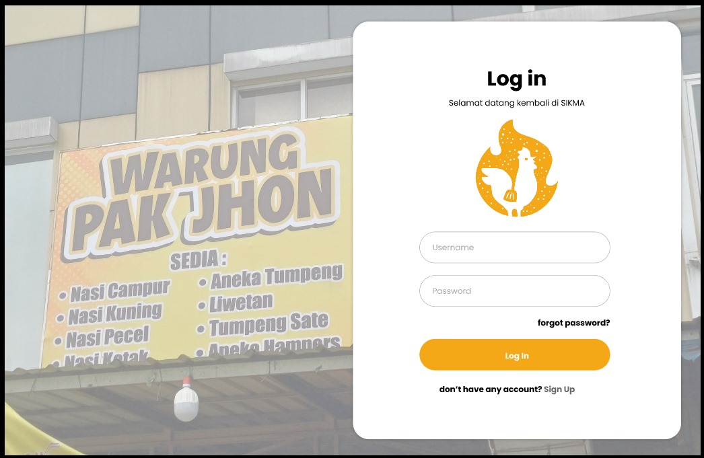
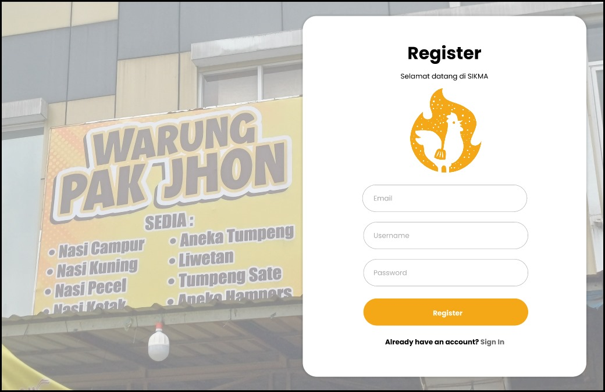
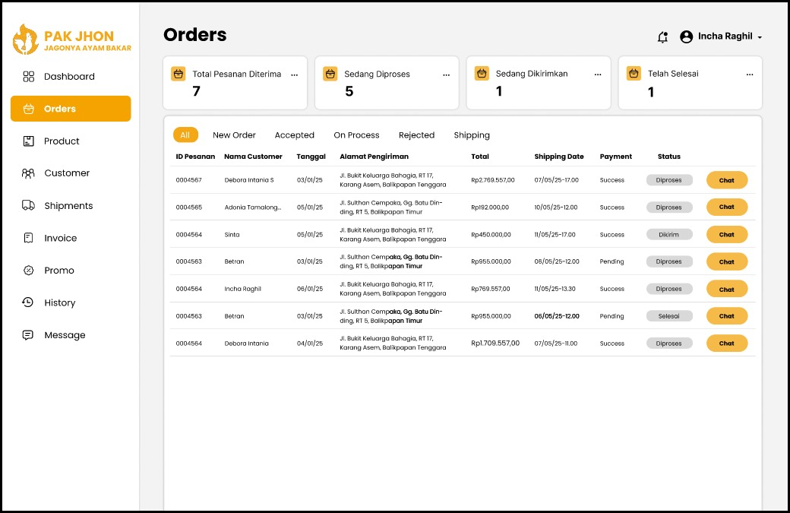
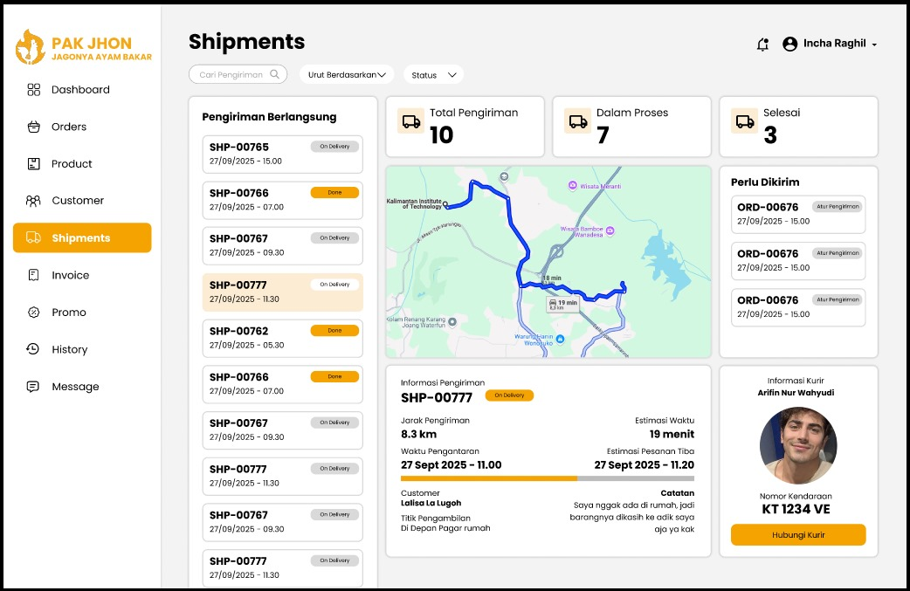
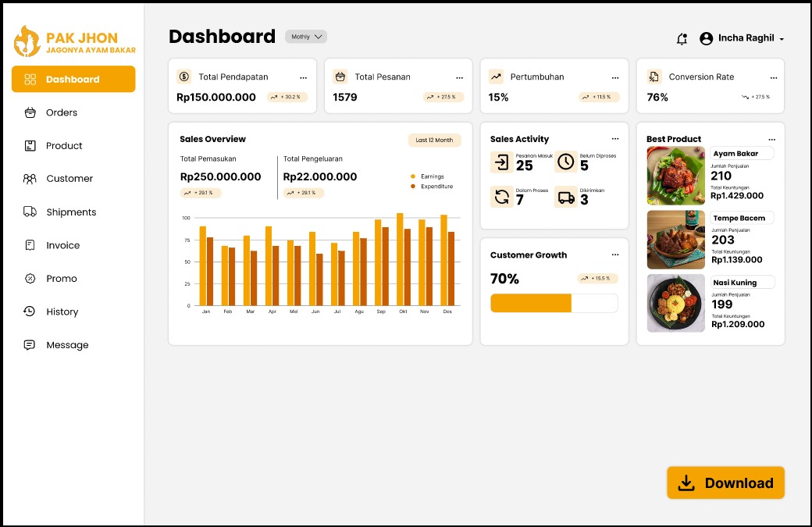
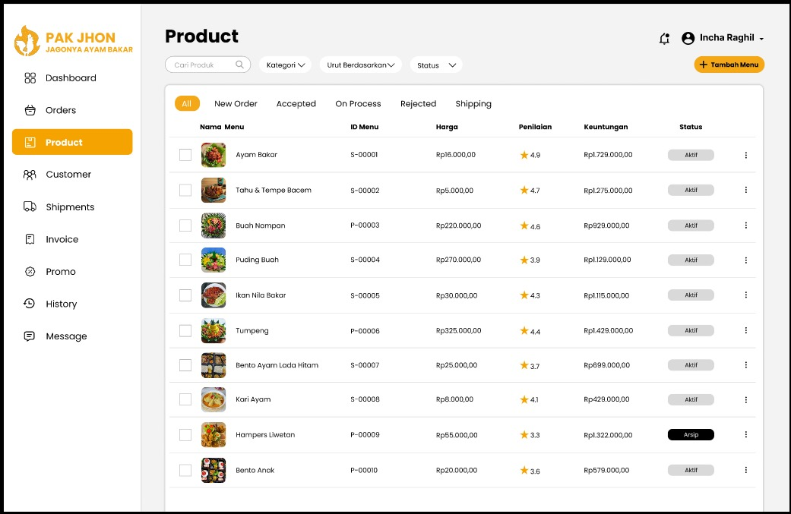
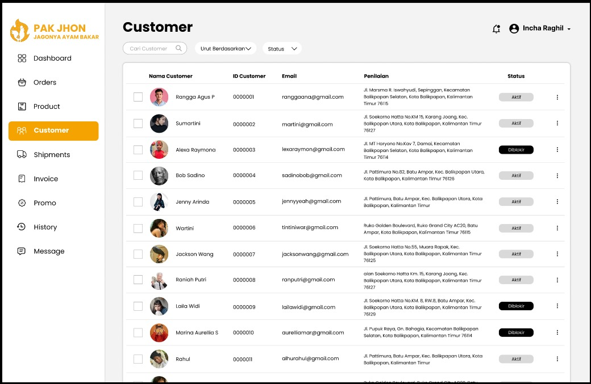

# Laporan Progres Mingguan - [SIKMA]
**Kelompok**: [3]

**Anggota**
    
    -Adonia Azarya Tamalonggehe (10231007)
    -Betran (10231023)
    -Debora Intania Subekti (10231029)
    -Incha Ragil (10231043)

**Mitra**: [Warung Pak Jhon]

**Pekan ke-**: [11]

**Tanggal**: [25/04/2025]

### Github SIKMA : https://github.com/intniaaa20/Sikma

## Progress Summary
Pada Tugas Pekan 11, fokus utama adalah mengimplementasikan sistem autentikasi (login/register) menggunakan JWT dan mengembangkan fitur inti pertama seperti manajemen menu makanan. Backend telah dilengkapi dengan endpoint REST API yang mendukung fitur tersebut, serta integrasi frontend-backend telah berhasil diuji. Hasilnya, pengguna dapat melakukan autentikasi dan mengakses salah satu fitur utama aplikasi. Langkah ini memperkuat fondasi SIKMA untuk pengembangan fitur lanjutan.

## Accomplished Tasks
- Implementasi sistem autentikasi (login/register)
- Implementasi fitur inti #1 (sesuai kebutuhan mitra)
- Integrasi frontend-backend untuk fitur yang sudah ada

## Dokumentasi
---

### **1. Halaman Login**

- **Deskripsi**: Halaman login untuk akses ke aplikasi SIKMA.
- **Fitur Utama**:
  - Form input untuk **Username** dan **Password**, memastikan pengguna dapat masuk dengan akun mereka.
  - Tombol **Login** untuk autentikasi serta opsi **Forgot Password?** untuk pemulihan akun.
  - Link **Sign Up** untuk pengguna baru yang ingin mendaftar.

---

### **2. Halaman Register**

- **Deskripsi**: Halaman pendaftaran akun baru di SIKMA.
- **Fitur Utama**:
  - Input untuk **Email**, **Username**, dan **Password**, memastikan data pengguna baru tersimpan dengan baik.
  - Tombol **Register** untuk membuat akun dan link **Sign In** bagi pengguna yang sudah memiliki akun.

---

### **3. Dashboard Utama (Orders)**

- **Deskripsi**: Dashboard utama untuk manajemen pesanan catering.
- **Fitur Utama**:
  - Statistik visual: **Total Pesanan Diterima**, **Sedang Diproses**, **Dalam Pengiriman**, dan **Telah Selesai**.
  - Tabel daftar pesanan dengan detail seperti **ID Pesanan**, **Nama Customer**, **Tanggal Pesanan**, **Alamat Pengiriman**, **Total Harga**, **Status Pengiriman**, serta tombol **Chat** untuk komunikasi langsung dengan pelanggan.

---

### **4. Dashboard Utama (Shipments)**

- **Deskripsi**: Dashboard untuk memantau status pengiriman pesanan.
- **Fitur Utama**:
  - Statistik pengiriman: **Pengiriman Berlangsung**, **Dalam Proses**, dan **Selesai**.
  - Detail pengiriman mencakup **ID Pengiriman**, **Nama Customer**, **Waktu Pengiriman**, dan status pengiriman.
  - Informasi tambahan seperti estimasi waktu pengantaran, lokasi pengambilan, serta catatan khusus dari pelanggan.

---

### **5. Dashboard Keuangan**

- **Deskripsi**: Halaman laporan keuangan untuk analisis bisnis.
- **Fitur Utama**:
  - Data keuangan mencakup **Total Pendapatan**, **Total Pengeluaran**, dan **Laba Bersih**.
  - Visualisasi berupa grafik atau tabel untuk mempermudah interpretasi data.
  - Indikator pertumbuhan pendapatan dan konversi pesanan untuk melihat performa bisnis.

---

### **6. Manajemen Produk**

- **Deskripsi**: Halaman untuk mengelola menu makanan yang disediakan.
- **Fitur Utama**:
  - Daftar produk mencakup **Nama Menu**, **ID Menu**, **Harga**, **Penilaian Pelanggan**, **Keuntungan**, dan status **Aktif/Nonaktif**.
  - Fitur pencarian dan filter berdasarkan kategori atau status produk.
  - Opsi **Edit** dan **Hapus** untuk memperbarui atau menghapus produk.

---

### **7. Manajemen Pelanggan**

- **Deskripsi**: Halaman untuk mengelola data pelanggan.
- **Fitur Utama**:
  - Daftar pelanggan mencakup **Nama Pelanggan**, **ID Pelanggan**, **Email**, **Alamat**, dan status **Aktif/Nonaktif**.
  - Fitur pencarian dan filter berdasarkan nama pelanggan atau lokasi.
  - Opsi **Edit** dan **Hapus** untuk memperbarui atau menghapus data pelanggan.

Bukti pengujian integrasi menunjukkan bahwa frontend dan backend SIKMA telah terhubung dengan baik melalui API. Halaman seperti **Dashboard Orders**, **Manajemen Produk**, **Manajemen Pelanggan**, dan **Shipments** berhasil menampilkan data dari database, seperti pesanan, produk, pelanggan, serta informasi pengiriman (alamat, waktu, dan status). Selain itu, fungsionalitas tambahan seperti tombol **Chat**, fitur pencarian, filter, dan navigasi antar halaman berjalan sesuai harapan. Ini membuktikan bahwa semua komponen aplikasi bekerja secara terintegrasi dan mendukung operasional yang efisien.

---

## Challenges & Solutions
- **Challenge 1**: kami mengalami kesulitan saat mengatur kepala ayam agar bergerak mengikuti cursor text 
  - **Solution**: kami masih belom mendapatkan cara untuk mengatasi nya 

## Next Week Plan
- Implementasi fitur inti #2 dan #3
- Penyempurnaan UI/UX
- Pengujian integrasi
- Demo progress ke mitra

## Contributions
- **Incha Ragil (Project Manager & UI/UX Designer)**: Membuat desain tampilan fitur utama
- **Debora Intania Subekti (Backend Developer)**: Pengembangan Sistem Autentikasi, Fitur Inti, dan Integrasi Frontend-Backend
- **Adonia Azarya Tamalonggehe (QA & DevOps)**: Menyusun Markdown,membantu Membuat desain tampilan fitur utama
- **Betran (Frontend Developer)**: Pengembangan Sistem Autentikasi, Fitur Inti, dan Integrasi Frontend-Backend