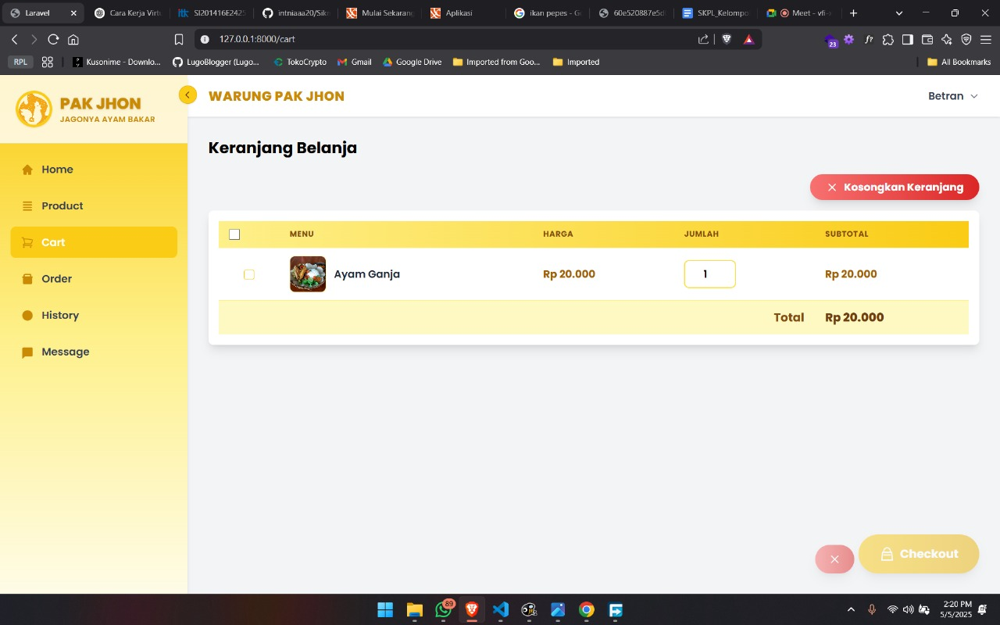
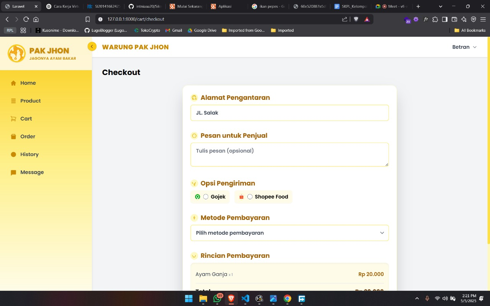
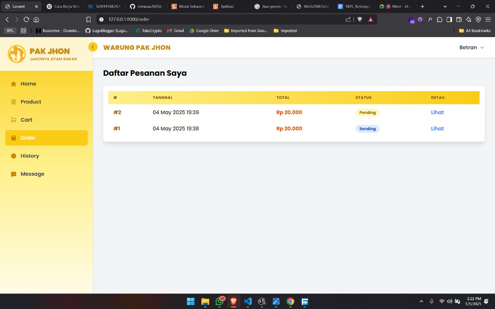

# Laporan Progres Mingguan - [SIKMA]
**Kelompok**: [3]

**Anggota**
    
    -Adonia Azarya Tamalonggehe (10231007)
    -Betran (10231023)
    -Debora Intania Subekti (10231029)
    -Incha Raghil (10231043)

**Mitra**: [Warung Pak Jhon]

**Pekan ke-**: [12]

**Tanggal**: [02/05/2025]

### Github SIKMA : https://github.com/intniaaa20/Sikma
### Figma SIKMA : https://www.figma.com/design/0lLAy1gRWl3SUQgvryOyKi/SIKMA?node-id=0-1&t=kr0uYpjr4UzalfBe-1

## Progress Summary
Untuk Pekan 12 , progres akan berfokus pada implementasi dua fitur inti lainnya (#2 dan #3), seperti manajemen ulasan atau riwayat pembelian. Selain itu, tim akan menyelesaikan penyempurnaan UI/UX untuk meningkatkan pengalaman pengguna. Pengujian integrasi juga akan dilakukan secara menyeluruh untuk memastikan semua komponen bekerja dengan baik.

## Accomplished Tasks
- **Implementasi fitur inti #2 dan #3**
- **Penyempurnaan UI/UX**
- **Pengujian integrasi**

--- 

## Dokumentasi Web Sikma
 

### **1. Halaman Keranjang Belanja**

- **Fitur Utama**:
  - Menampilkan daftar item yang telah ditambahkan ke keranjang.
  - Kolom utama: **Menu**, **Harga**, **Jumlah**, dan **Subtotal**.
  - Tombol **Kosongkan Keranjang** untuk menghapus semua item.
  - Tombol **Checkout** untuk melanjutkan ke proses pembayaran.

- **Tujuan**:
  - Memungkinkan pengguna mengecek isi keranjang sebelum melakukan transaksi.
  - Memberikan opsi untuk mengedit jumlah barang atau menghapus item tertentu.

---

### **2. Halaman Detail Menu (Ayam Ganja)**

- **Fitur Utama**:
  - Gambar menu dengan deskripsi lengkap.
  - Informasi harga, status ketersediaan (**Tersedia**), dan kategori (**ayam**, **nasi**, **es teh**).
  - Deskripsi rinci tentang menu, termasuk jenis hidangan, tekstur, cita rasa, dan warna.

- **Tujuan**:
  - Memberikan informasi detail tentang makanan kepada pelanggan sebelum memesan.
  - Membantu pelanggan memahami produk yang akan dipesan.

---

### **3. Halaman Checkout**

- **Fitur Utama**:
  - Formulir **Alamat Pengantaran** untuk memasukkan alamat tujuan.
  - Opsi **Pesan untuk Penjual** untuk catatan tambahan (opsional).
  - Pilihan **Opsi Pengiriman**: Gojek atau Shopee Food.
  - Pilihan **Metode Pembayaran** (dropdown untuk metode pembayaran).
  - Rincian pesanan, termasuk nama menu dan total harga.

- **Tujuan**:
  - Mengumpulkan data penting seperti alamat pengiriman, catatan tambahan, dan preferensi pengiriman/pembayaran.
  - Memastikan pelanggan dapat menyelesaikan transaksi dengan lancar.

---

### **4. Halaman Menu Kami**

- **Fitur Utama**:
  - Daftar menu dengan gambar, nama, harga, dan deskripsi singkat.
  - Fitur pencarian menu menggunakan kolom **Cari nama menu**.
  - Filter berdasarkan kategori (semua, ayam, ikan, dll.).
  - Tombol **Show more** untuk melihat deskripsi lengkap.
  - Tombol **Tambah ke Keranjang** (+) untuk menambahkan menu ke keranjang.

- **Tujuan**:
  - Menampilkan seluruh menu yang tersedia di warung.
  - Memudahkan pelanggan mencari dan memilih menu sesuai kebutuhan.

---

### **5. Halaman Daftar Pesanan Saya**

- **Fitur Utama**:
  - Tabel daftar pesanan dengan kolom: **Nomor Pesanan**, **Tanggal Pesanan**, **Total Harga**, **Status Pesanan**, dan tombol **Lihat**.
  - Status pesanan seperti **Pending**, **Sending**, **Delivered**, dll.
  - Tombol **Lihat** untuk melihat detail pesanan lebih lanjut.

- **Tujuan**:
  - Menampilkan riwayat pesanan pelanggan.
  - Memungkinkan pelanggan memantau status pesanan mereka secara real-time.

---
Pengujian integrasi telah dilakukan untuk memastikan bahwa frontend, backend, dan database SIKMA bekerja secara harmonis. Halaman seperti Cart , Checkout , dan Orders menunjukkan bahwa data dari frontend (misalnya, input alamat pengiriman atau metode pembayaran) berhasil diproses oleh backend dan disimpan di database PostgreSQL. Selain itu, halaman Menu Kami membuktikan bahwa backend dapat mengambil data produk dari database dan menampilkannya di frontend dengan fitur pencarian dan filter yang berfungsi dengan baik. Pengujian juga mencakup fungsionalitas tambahan seperti tombol Tambah ke Keranjang , Chat , dan pembaruan status pesanan secara real-time di halaman Shipments , yang semuanya berjalan sesuai harapan.

## Challenges & Solutions
- **Challenge 1**: konflik database saat fresh migrate, yang terjadi saat ada penambahan database sehingga integrasi antara program dan postgresql terganggu. 
- **Solution**: solusinya dianalisis kembali dan di pull ulang

- **Challenge 2**: Kesulitan dalam mengimplementasi desain di figma dan fitur ke dalam website 
- **Solution**: solusinya kami menyerdehanakan desain mockup

## Next Week Plan
- **Implementasi fitur inti #4**
- **Pembuatan admin panel sederhana**
- **Visualisasi data sederhana**
- **Demo progress ke mitra**

## Contributions
- **Incha Raghil (Project Manager & UI/UX Designer)**: melanjutkan desain wireframe di figma
- **Debora Intania Subekti (Backend Developer)**: melanjutkan fitur inti #2 dan #3 sesuai denga desain yang ada di figma 
- **Adonia Azarya Tamalonggehe (QA & DevOps)**: Menyusun Markdown dan Membuat desain wireframe
- **Betran (Frontend Developer)**: melanjutkan fitur inti #2 dan #3 sesuai denga desain yang ada di figma