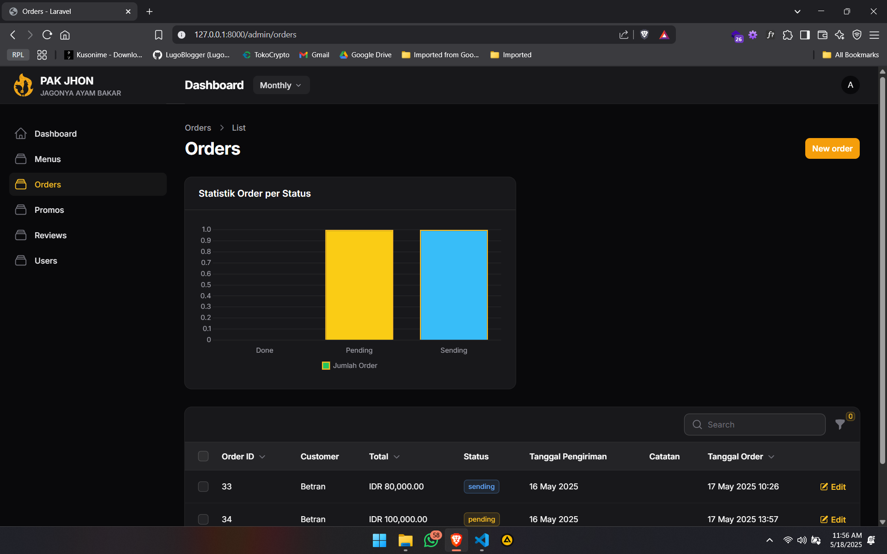

# Laporan Progres Mingguan - **SIKMA**  
**Kelompok**: [3]  

---

### **Anggota Kelompok**
- **Adonia Azarya Tamalonggehe** (10231007)  
- **Betran** (10231023)  
- **Debora Intania Subekti** (10231029)  
- **Incha Raghil** (10231043)  

---

### **Mitra**: Warung Pak Jhon  
### **Pekan ke-**: [14]  
### **Tanggal**: [15/05/2025]  

---

### **Referensi Proyek**
- **GitHub SIKMA**: [https://github.com/intniaaa20/Sikma](https://github.com/intniaaa20/Sikma)  
- **Figma SIKMA**: [https://www.figma.com/design/0lLAy1gRWl3SUQgvryOyKi/SIKMA?node-id=0-1&t=kr0uYpjr4UzalfBe-1](https://www.figma.com/design/0lLAy1gRWl3SUQgvryOyKi/SIKMA?node-id=0-1&t=kr0uYpjr4UzalfBe-1)  

---

## **Progress Summary**  
Pada **Pekan 14** fokus utama adalah melakukan penyempurnaan dan penyelesaian akhir proyek SIKMA (Sistem Informasi Catering Makanan). Tim akan melakukan debugging untuk menangani bug atau masalah teknis yang mungkin masih ada, sekaligus mengoptimalkan fitur-fitur inti seperti manajemen menu, pesanan, pembayaran, dan admin panel. Selain itu, pengujian usabilitas akan dilakukan guna memastikan aplikasi memberikan pengalaman yang nyaman dan sesuai dengan kebutuhan pengguna. Sebagai tambahan, visualisasi data sederhana akan diintegrasikan ke dalam dashboard admin untuk memberikan wawasan lebih jelas terkait kinerja sistem.

---

## **Accomplished Tasks**  
- **Penyempurnaan seluruh fitur**
- **Bugfixing**
- **Usability testing**
- **Persiapan deployment**
- **Visualisai data sederhana**

---

USABILITY TESTING
Pada tahap ussability testing ini kami menggunakan metode thinking aloud yang memungkinkan kami dapat mendengarkan pengguna menyampaikan langsung pendapatnya tentang penggunaan aplikasi secara luas. 

Nama Pengguna: Nabella
Usia: 25 tahun
Peran: Karyawan di Warung Pak Jhon
Tingkat kefamiliaran dengan teknologi: Cukup familiar, pengguna mengerti bagaimana cara penggunaan gadget seperti laptop

Skenario & tugas
1. Login ke akun
	- Berdasarkan percobaan yang dilakukan, proses login ke akun SIKMA dapat dilakukan dengan lancar tanpa ada kendala. Pengguna dapat menggunakan akun yang memang telah terdaftar ke dalam sistem.
    
     
2. Halaman Dashboard
	- Halaman dashboar belum selesai dikerjakan alhasil pengguna belum bisa mencoba untuk membaca dan memahami bagaimana cara kerja dari dashboard yang akan dihadiskan dalam sistem.
    
     
3. Manajemen menu makanan
	- Berdasarkan percobaan, pengguna telah mencoba untuk memanajemen menu yaitu menambahkan, mengedit, dan menghapus menu makanan. Berdasarkan percobaan yang dilakukan, pengguna mengatakan bahwa proses manajemen menu cukup mudah untuk dilakukan, setiap navigasi mudah dipahami sehingga pengguna tidak kebingungan untuk melakukan tindakan.
    
     
4. Manajemen Pelanggan
	- Pada fitur ini pengguna mencoba untuk menguji keberhasilan data-data customer yang pernah memesan menu beserta data-data customer yang pernah memesan menu beserta detail dan status pemesanannya. Karena sistem belum di deployment, maka percobaan ini menggunakan data dummy yang telah kami sediakan berdasarkan fitur yang kami bangun pada sistem dari sisi customer. Menurrut pengguna, fitur manajemen pelanggan yang disediakan cukup mudah untuk digunakan. 
    
     
5. Manajemen pesanan & history pesanan 
	- Pada halaman manajemen pesanan, terdpat beberapa informasi yang dapat dilihat oleh penggunayaitu pesanan masuk dan seluruh catatan pesanan yang masuk . Berdasarkan percobaan testing yang dilakukan oleh pengguna, pengguna dapat memahami seluruh navigasi dengan baik, akan tetapi pada history pemesanan masih terdapat informasi yang kurang seperti informasi mengenai detail history pengiriman yaitu alamat penguna, nama pengirim, tanggal pengiriman, informasi penerima, dan ulasan pelanggan.
---

## 🛠️ Penyempurnaan Fitur dan Bugfixing

Pada tahap penyempurnaan fitur ini, telah dilakukan evaluasi dan perbaikan terhadap sebagian besar fitur inti aplikasi SIKMA (Sistem Informasi Catering Makanan) untuk memastikan performa sistem semakin stabil dan pengalaman pengguna semakin baik. Beberapa fitur utama seperti manajemen menu, pesanan, pembayaran, serta bagian pengelolaan pelanggan telah diuji coba dan berjalan sesuai harapan.

Selain itu, proses *bugfixing* juga telah dilakukan untuk mengatasi beberapa masalah teknis yang ditemukan selama pengujian, antara lain:

- **Validasi Input**: Perbaikan agar pengguna tidak dapat mengirimkan data yang tidak valid.
- **Integrasi API Pembayaran**: Memastikan semua metode pembayaran bekerja dengan baik dan transaksi tercatat secara akurat.
- **Optimasi Kinerja**: Halaman checkout dan dashboard admin telah dioptimalkan untuk meningkatkan responsivitas.
- **Perbaikan Navigasi**: Tombol dan link navigasi kini berfungsi lebih stabil tanpa error.

Sebagai hasil dari perbaikan ini, mayoritas fitur sudah berjalan dengan lancar dan aman digunakan, termasuk dalam hal:

- **Keakuratan Data**: Data produk dan pelanggan kini tampil lebih akurat.
- **Keamanan Transaksi**: Integrasi API Midtrans memastikan proses pembayaran berjalan aman dan terenkripsi.
- **Kemudahan Operasional**: Bagian manajemen menu dan pelanggan telah dirancang agar mudah dikelola oleh mitra.

Namun, berdasarkan hasil *usability testing*, beberapa area masih memerlukan penyelesaian dan penyempurnaan, seperti:
- **Halaman Dashboard Admin** yang masih dalam tahap pengembangan dan belum dapat diujikan secara maksimal.
- **Fitur History Pesanan** yang masih belum menampilkan informasi lengkap seperti alamat pengiriman, nama penerima, tanggal pengiriman, dan ulasan pelanggan.

---

### **Visualisasi Data Sederhana: Statistik Pesanan Berdasarkan Status**

Gambar ini menunjukkan implementasi **visualisasi data sederhana** pada halaman **Orders** di dashboard admin SIKMA. Fitur ini bertujuan untuk memberikan wawasan cepat tentang kinerja sistem pesanan kepada admin Warung Pak Jhon. Berikut adalah penjelasan singkat:

- **Statistik Pesanan Berdasarkan Status**:
  - Terdapat grafik batang sederhana yang menampilkan jumlah pesanan berdasarkan statusnya, seperti **Done**, **Pending**, dan **Sending**.
  - Grafik ini menggunakan warna berbeda untuk masing-masing status: **kuning** untuk **Done**, **biru** untuk **Pending**, dan **biru muda** untuk **Sending**.
  - Data ditampilkan dalam skala numerik pada sumbu Y, dengan jumlah pesanan yang sesuai untuk setiap status.

### **Tujuan Visualisasi Data**:
- **Meningkatkan Kejelasan**: Grafik sederhana memudahkan admin untuk melihat distribusi pesanan berdasarkan status secara visual.
- **Pengambilan Keputusan**: Data ini membantu admin memantau kinerja pesanan, seperti jumlah pesanan yang sedang diproses, dikirim, atau selesai, sehingga dapat mengambil tindakan yang tepat.
- **Efisiensi**: Dengan visualisasi ini, admin dapat dengan cepat memahami tren pesanan tanpa harus melihat setiap pesanan secara manual.

Dengan implementasi ini, dashboard admin menjadi lebih informatif dan membantu Warung Pak Jhon dalam mengelola pesanan dengan lebih efisien.

---

## **Challenges & Solutions**

### **Challenge 1: Dashboard Admin Belum Selesai**
- **Masalah**: Halaman dashboard admin masih dalam tahap pengembangan, sehingga belum bisa diujikan secara maksimal kepada pengguna.
- **Solusi**: Tim fokus menyelesaikan tampilan dan fungsionalitas dasar dashboard agar siap digunakan untuk presentasi final. Penyempurnaan fitur tambahan akan dilanjutkan setelah presentasi jika diperlukan.

### **Challenge 2: Visualisasi Data Masih Sederhana**
- **Masalah**: Visualisasi data hanya menampilkan statistik pesanan berdasarkan status, dan belum mencakup informasi penting lain seperti tren harian atau jumlah menu terlaris.
- **Solusi**: Untuk saat ini, visualisasi dibuat sederhana agar tetap ringan dan mudah dimengerti. Rencana penambahan grafik lanjutan disiapkan untuk pengembangan pasca-presentasi.

### **Challenge 3: Informasi History Pesanan Tidak Lengkap**
- **Masalah**: Pada manajemen pesanan, informasi detail history pengiriman seperti alamat pengirim/penerima, tanggal pengiriman, dan ulasan pelanggan belum ditampilkan.
- **Solusi**: Tim melakukan penyesuaian struktur database dan memperbaiki logika tampilan data agar informasi dapat ditampilkan secara lengkap sesuai kebutuhan pengguna.

---

## **Next Week Plan**  
- Presentasi final ke mitra dan dosen
- Dokumentasi lengkap (README, API docs, user manual)
- Penyerahan kode sumber dan deployment
- Evaluasi proyek dan lessons learned

---

## **Contributions**  
- **Incha Raghil (Project Manager & UI/UX Designer)**: mengkoordinasikan progres tim, serta melakukan usability testing bersama mitra. Turut menyusun laporan
- **Debora Intania Subekti (Backend Developer)**: Memperbaiki logika backend, validasi input, dan integrasi API pembayaran untuk meningkatkan stabilitas sistem.
- **Adonia Azarya Tamalonggehe (QA & DevOps)**: Melakukan pengujian aplikasi, usability testing, serta menyiapkan lingkungan deployment. Juga bertugas dalam penyusunan laporan
- **Betran (Frontend Developer)**: Menyelesaikan tampilan halaman utama dan mengintegrasikan visualisasi data sederhana di dashboard admin.